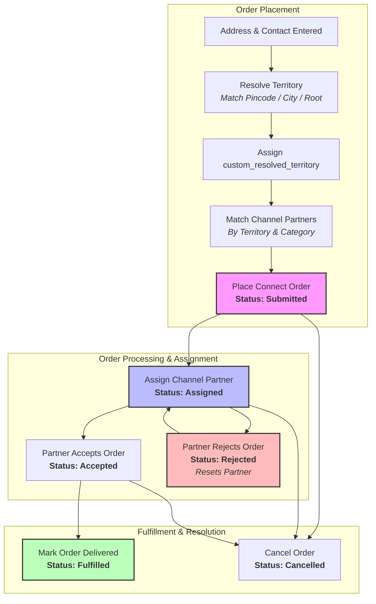

# Connect Order Management & Fulfillment Flow

> Detailed business flow and document lifecycle for the Connect Master application. Use this document to understand key document definitions, roles, geocoding territory resolution, and channel partner assignment rules.

---

## 1. Overview of the Flow

The **Connect Master** application operates on an intelligent order-taking and offline fulfillment model. It acts as a bridge connecting orders placed by customers to localized channel partners. Fulfillment is managed offline by the channel partners themselves, and orders are marked as fulfilled on the platform.



---

## 2. Key Differences from ERPNext Standard Order Flow

* **No Customer DocType Dependency**: Instead of using the standard ERPNext `Customer` DocType, the app relies directly on the `Address` and `Contact` documents. All order-specific details are captured directly in the `Connect Order` document.
* **Geographical Order Collection**: Orders are categorized and distributed based on **Service Territories** (nested geographic areas down to the pincode level) and **Service Channels** (business categories).
* **Offline Fulfillment**: Company inventory and billing flows (Sales Order -> Delivery Note -> Sales Invoice) are not used. Orders are dispatched to independent **Channel Partners** who handle inventory, delivery, and payment collection offline.

---

## 3. Core DocType Definitions

### 1. Connect Order (`Connect Order`)
* **Definition**: A submittable document containing ordered items, shipping address, contact, assigned channel partner, status, and timeline events.
* **Autonaming**: Uses `hash` naming format (random string) to ensure unique, non-sequential order IDs.
* **Timeline Events**: Every status update or field change appends a record to the `timeline` child table (`Connect Order Timeline Event`).
* **Order Statuses**: 
  - `Submitted`: Initial status after order creation.
  - `Assigned`: Channel partner has been assigned.
  - `Accepted`: Channel partner accepted the assignment.
  - `Rejected`: Channel partner rejected the assignment. Resets `channel_partner` to `None` and status to `Rejected`.
  - `Cancelled`: Order was cancelled.
  - `Fulfilled`: Order was successfully delivered offline. Sets the `resolved_timestamp`.

### 2. Service Territory (`Service Territory`)
* **Definition**: A hierarchical tree structure representing geographic operating zones.
  - **Group/Parent Territories**: Districts, Cities, or large regions.
  - **Leaf Territories**: Specific Pincodes (e.g., `600048`).
* **Tree Structure**: Employs the Nested Set Model (`lft` and `rgt` coordinates) to support lightning-fast sub-tree operations (finding child/descendant territories).

### 3. Service Channel (`Service Channel`)
* **Definition**: Represents logical groupings of business categories that dictate how channel partners fulfill orders:
  - **Pharma**: Operates with a 90-day credit term.
  - **General Trade (GT)**: Immediate cash-and-carry model.
  - **Modern Trade (MT)**: Bulk purchase, payment made post-sale.
  - **Direct Customer**: Standard eCommerce model.

### 4. Connect Channel Partner (`Connect Channel Partner`)
* **Definition**: Independent business entities serving specific territories and channels.
* **Mapping**: Has child tables linking them to allowed `Service Channels` (`service_channels`), active `Service Territories` (`service_territories`), and `Excluded Service Territories` (`excluded_service_territories`).

---

## 4. Intelligent Order Assignment (Matching Algorithm)

When an order is created, the system must show available `Channel Partners` based on the delivery location's territory and service category.

### The Algorithm (`get_channel_partners`)
1. **Ancestry Traversal**: Fetch the `lft` and `rgt` coordinates of the address's `custom_resolved_territory`. Find all ancestor territories (including the territory itself) in the tree:
   ```sql
   SELECT name FROM `tabService Territory` WHERE lft <= Address.lft AND rgt >= Address.rgt
   ```
2. **Channel & Territory Filtering**: Filter for active channel partners mapped to the address's `Service Channel` and assigned to any of the resolved ancestor territories.
3. **Exclusion Check**: Exclude any partner that has the resolved territory listed in their `excluded_service_territories` list.
4. **Specificity Sorting**: Order results by `MAX(st.lft) DESC`. This ensures the partner serving the most specific (deepest in tree) territory is ranked highest.

---

## 5. Territory Resolution

To automate territory matching, the system maps address pincodes or cities to `Service Territories`:
* **Database-Driven Resolution**: When a user saves an address in the **Koda SPA** frontend, the system resolves `custom_resolved_territory` on the client side by executing sequential queries against the `Service Territory` table.
* **Resolution Hierarchy**:
  1. **Pincode Exact Match**: Checks if the address's `pincode` matches the `name` of a `Service Territory`. If not found, checks if it matches a record's `territory_name`.
  2. **City Match**: Fallback query for a `Service Territory` whose `territory_name` matches the address's `city` (with `allow_in_search = 1` set).
  3. **Root Fallback**: Fallback to the root territory (where `parent_service_territory` is empty/null).
* **Address Save**: The matched territory name is saved to the custom field `custom_resolved_territory` on the `Address` record.
* **Territory Release (`release_territory`)**:
  - In cases where an order cannot be served by the resolved leaf territory, a Territory Admin can "release" it.
  - This resets the address's `custom_resolved_territory` to the root/parent-most territory (e.g. City or District level), resets `channel_partner` to `None`, sets status to `Submitted`, and appends a field-change timeline event.

---

## 6. Background Jobs & Scheduler Events

* **Unresolved Push Job (`check_unresolved_orders`)**:
  - Registered under the `hourly` scheduler hook.
  - Scans for orders with an active status (not `Fulfilled` or `Cancelled`) where the `order_date` is older than **7 days** and `unresolved_push` is `0`.
  - Automatically flags these orders with `unresolved_push = 1` so they appear on the Territory Manager's dashboard for manual escalation.

---

## 7. Role-Based List Permissions

List filters and access controls are implemented in `api.py` under `_get_list_conditions()`:
* **System Manager**: Can view all orders (`1=1`).
* **Territory Admin**: 
  - Restricts view to orders whose delivery address falls within their assigned territories or descendant sub-territories (resolved via `lft` and `rgt` ranges).
* **Partner Admin**:
  - Restricts view to orders assigned specifically to their mapped `Connect Channel Partner` record.
* **Customer**:
  - Only allowed access to place and track their own orders. Authenticated via a secure 6-digit OTP verification system (`send_otp`/`verify_otp`).

---

## 8. API Integration Reference

| Method | Endpoint | Description |
| :--- | :--- | :--- |
| `POST` | `/api/method/connect_master.api.send_otp` | Generates a 6-digit OTP and sends it via configured SMTP settings (expires in 5 minutes). Creates a Guest user with `Customer` role if new. |
| `POST` | `/api/method/connect_master.api.verify_otp` | Verifies the OTP and initiates a standard Frappe session login. |
| `GET` | `/api/method/connect_master.api.get_compass_orders` | Fetches filtered lists of orders categorized by tabs (`Active`, `Unresolved`, `History`) matching role restrictions. |
| `GET` | `/api/method/connect_master.api.get_channel_partners` | Executes the matching algorithm to find valid channel partners for a given territory and channel. |
| `POST` | `/api/method/connect_master.api.assign_channel_partner` | Assigns a partner to an order and updates the order status to `Assigned`. |
| `POST` | `/api/method/connect_master.api.release_territory` | Escalates an order's territory to the root ancestor and resets partner assignment. |
| `POST` | `/api/method/connect_master.api.mark_order_delivered` | Completes the order flow by setting status to `Fulfilled` and recording delivery details. |

---

## 9. API Testing Collection

A complete Postman Collection is available for testing the API workflows of the app:
* **JSON File**: [connect_master_postman_collection.json](file:///workspace/development/frappe-bench/agenticdocs/skills/connect_master/connect_master_postman_collection.json)
* Contains pre-configured endpoints for **Authentication** (OTP flows), **Metadata Queries**, **Order Listing**, and the full **Order Lifecycle** transitions.

