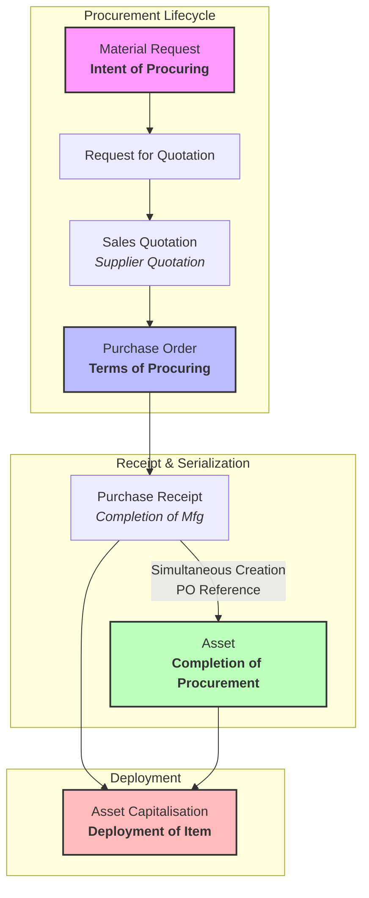

# Procurement-based Asset Deployment

> Detailed business flow and document lifecycle for the Swift Fix application. Use this document to understand key document definitions, state transitions, validations, and the relationships between procurement documents.

---

## 1. Overview of the Flow

The Swift Fix application operates on a custom business process called **Procurement-based Asset Deployment**. This flow tracks the lifecycle of materials and equipment from initial intent, through negotiations, purchase commitments, receipt of goods, and serialization, to final capitalization/deployment in the field.

---

## 2. Core Procurement Status Landmarks

There are three primary document states that define the status of the entire procurement lifecycle:

| Document | Abbreviation | Core Significance |
| :--- | :--- | :--- |
| **Material Request** | **MR** | Defines the **intent of procuring**. |
| **Purchase Order** | **PO** | Defines the **contractual terms of procuring** with the vendor/supplier. |
| **Asset** | **Asset** | Defines the **completion of procurement**. |

---

## 3. Document Roles and Rules

### 1. Material Request (MR)
* **Definition**: Initiates the procurement lifecycle by stating the intent to acquire a material or service.
* **Hiding Action Buttons**: Standard "Purchase Order" and "Supplier Quotation" action buttons under the `Create` group must be hidden from the Material Request form, as raising POs or SQs directly from the MR is not allowed in this workflow.
* **Custom Processing Status**: Status of MR is tracked via the custom field `custom_processing_status` (e.g. `Draft`, `Shortlisted`, `Cancelled`, `Held`, `Asset Capitalised`).
* **Item Validation**: Only allow items with `is_fixed_asset = 1` to be added to a Material Request. If any item has `is_fixed_asset` different from 1, a validation error must be thrown.

### 2. Request for Quotation (RFQ)
* **Definition**: A document sent to one or more suppliers/vendors to request a quote.
* **Validation**:
  * An RFQ must link to a Material Request via the custom field `custom_request_details`.
  * **Save Restriction**: RFQ cannot be saved/submitted unless the linked Material Request status (`custom_processing_status`) is **Shortlisted**.
* **Submit Side-Effect**:
  * Upon submission of an RFQ, a timeline comment must be automatically posted to the linked Material Request:
    > `"A Quotation is requested from Vendor and Recce Process is in Progress"`

### 3. Sales Quotation (SQ)
* **Definition**: The pricing quotation received back from the supplier/vendor (sometimes referred to as the Supplier Quotation).
* **Role**: Details vendor pricing, dimensions, and specifications for evaluation against the RFQ.

### 4. Purchase Order (PO)
* **Definition**: Formal contract issued to the supplier specifying terms, pricing, and quantities.
* **Role**: Locks in the terms of the procurement.
* **State Constraint**: If an active (submitted and not Closed or Completed) Purchase Order exists for a Material Request, the MR status cannot be changed to `Cancelled` or `Held`.
* **Submit Hook (`on_po_submit`)**:
  * Upon submission of a PO, if no Purchase Receipts or Assets have been generated for it yet, the linked Material Request's `custom_processing_status` must automatically transition to **Under Process**.
  * A timeline comment is posted on the MR: `"Status updated to Under Process upon submission of Purchase Order [PO_Name]"`.

### 5. Purchase Receipt (PR)
* **Definition**: Signifies the completion of the manufacture/supply of the item based on the specifications.
* **Serialization**:
  * A unique **Serial Number** must be generated for the item upon completion/submission of the Purchase Receipt.
* **Simultaneous Creation**:
  * At the same time the Purchase Receipt is created/submitted, an associated **Asset** document must be created automatically.
  * Both the PR and the new Asset must reference the shared Purchase Order (PO) in common.
* **Submit Hook (`on_pr_submit`)**:
  * Upon submission of a PR, the associated PO's status is forced to **Completed**.
  * The linked Material Request's `custom_processing_status` automatically transitions to **Item Received**.
  * A timeline comment is posted on the MR: `"Status updated to Item Received as Purchase Order [PO_Name] is completed via Purchase Receipt [PR_Name]"`.

### 6. Asset
* **Definition**: The resulting asset record representing completion of the procurement phase.
* **State**: Contains serialization information and references the original Purchase Order.

### 7. Asset Capitalisation
* **Definition**: Signifies the actual **deployment** of the item received from the Purchase Receipt.
* **Validation / Linkage**:
  * Matches the received item from the PR to an Asset that shares the same Purchase Order (PO) reference.
* **Submit Hook (`on_asset_capitalization_submit`)**:
  * Upon submission of an Asset Capitalization, the linked Material Request's `custom_processing_status` automatically transitions to **Asset Capitalised**.
  * A timeline comment is posted on the MR: `"Status updated to Asset Capitalised upon submission of Asset Capitalization [AC_Name]"`.

---

## 4. Implementation Guidelines & File Locations

When maintaining or extending this flow, ensure compliance with these components:

* **Server-Side Hooks & Validation**:
  * **Event Handlers**: Implemented in [popr_utils.py](file:///workspace/development/frappe-bench/apps/swift_fix/swift_fix/setup/popr_utils.py). Handles `on_po_submit`, `on_pr_submit`, and `on_asset_capitalization_submit`.
  * **RFQ Validation**: Located in [rfq_update.py](file:///workspace/development/frappe-bench/apps/swift_fix/swift_fix/setup/rfq_update.py). Handles RFQ save restrictions and submit timeline comments.
  * **Backend Utilities**: Located in [mr_utils.py](file:///workspace/development/frappe-bench/apps/swift_fix/swift_fix/setup/mr_utils.py). Contains functions such as `change_mr_status`, `has_active_po`, `has_completed_po`, `analyze_mr`, and `validate_mr`.
  * **Hooks Registry**: Registered in [hooks.py](file:///workspace/development/frappe-bench/apps/swift_fix/swift_fix/hooks.py) under the `doc_events` section for the `Material Request`, `Request for Quotation`, `Purchase Order`, `Purchase Receipt`, and `Asset Capitalization` Doctypes.
* **Client-Side Scripts**:
  * Located in [client_script.json](file:///workspace/development/frappe-bench/apps/swift_fix/swift_fix/fixtures/client_script.json).
  * Controls dynamic UI banner updates (showing Material Request status in the HTML field without marking the form dirty) and client-side save/action button behaviors.
  * **Button Hiding Rules**: If a linked Purchase Order is in `'Completed'` status, the `'Change Status'` group containing `'Cancel'`, `'Hold'`, and `'Shortlist'` buttons is hidden completely on the Material Request form.
  * **Dynamic Analysis HTML**: Displays a summary of other Material Requests, assets, and a table of linked Purchase Orders with their names, transaction dates, statuses, and grand totals.
* **Custom Fields**:
  * Configured in [custom_field.json](file:///workspace/development/frappe-bench/apps/swift_fix/swift_fix/fixtures/custom_field.json).

---

## 5. REST API Integration & Postman Testing

To facilitate mobile client integration and testing, a Postman API collection is provided at [swift_fix_procurement.postman_collection.json](file:///workspace/development/frappe-bench/.agents/skills/procurement-flow/resources/swift_fix_procurement.postman_collection.json).

### Collection Variables

The collection relies on the following Postman environment/collection variables:
* `baseUrl`: The base URL of the CMMS instance (default: `http://cmms.localhost`).
* `usr`: The credentials username (default: `Administrator`).
* `pwd`: The credentials password (default: `admin`).
* `mrName`, `rfqName`, `poName`, `poItemName`, `prName`, `acName`: Dynamic resource names to chain workflow steps sequentially.

### Endpoint Categories

1. **Authentication**: Call the `Login` method (`POST /api/method/login`) first. Postman will automatically manage and attach the session cookie to subsequent requests.
2. **Material Request**:
   * Create MR: `POST /api/resource/Material Request`
   * Submit MR: `PUT /api/resource/Material Request/{{mrName}}` (passes `{"docstatus": 1}`)
   * Change MR Status: `POST /api/method/swift_fix.setup.mr_utils.change_mr_status` (transitions MR status)
   * Get MR Status Details: `GET /api/method/swift_fix.setup.mr_utils.get_mr_status_details`
   * Analyze MR Location: `GET /api/method/swift_fix.setup.mr_utils.analyze_mr`
3. **Request for Quotation**:
   * Create RFQ: `POST /api/resource/Request for Quotation`
   * Submit RFQ: `PUT /api/resource/Request for Quotation/{{rfqName}}`
   * Update RFQ dimensions: `POST /api/method/swift_fix.setup.rfq_update.rfq_update_dimensions`
   * Update RFQ dimensions and photos: `POST /api/method/swift_fix.setup.rfq_update.rfq_update_dimensions_with_images`
   * Change Recce status: `POST /api/method/swift_fix.setup.rfq_update.rfq_change_recce_status`
4. **Purchase Order**:
   * Create PO: `POST /api/resource/Purchase Order`
   * Submit PO: `PUT /api/resource/Purchase Order/{{poName}}`
5. **Purchase Receipt**:
   * Create PR: `POST /api/resource/Purchase Receipt`
   * Submit PR: `PUT /api/resource/Purchase Receipt/{{prName}}`
6. **Asset Capitalization**:
   * Create Asset Capitalization: `POST /api/resource/Asset Capitalization`
   * Submit Asset Capitalization: `PUT /api/resource/Asset Capitalization/{{acName}}`

